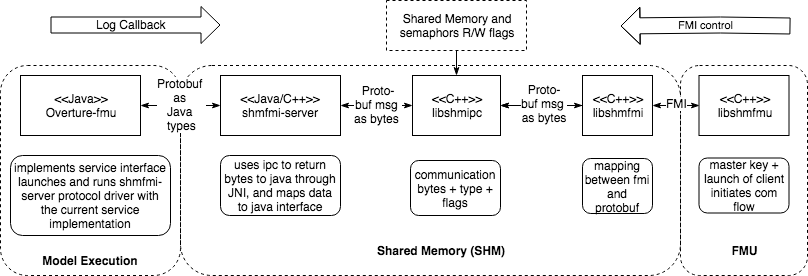

# SHared Memory FMI

[](https://build.overture.au.dk/jenkins/job$)

[](http://www.gnu.org/licenses/gpl-3.0.html)

[](http://search.maven.org/#search$)

# Project overview

The overview of the Overture-FMU is presented in this section. For more details, please see the publication [Overture FMU: Export VDM-RT Models as
Tool-Wrapper FMUs](https://www.ncl.ac.uk/media/wwwnclacuk/schoolofcomputingscience/files/trs/1524.pdf#section*.9).

The COE and Overture-FMU communicated via IPC (shared memory) based on protobuf messages.



Libraries corresponding to project directories are marked with *italic*, i.e.:
*libshmfmu* acts as the FMU interface from the COE process.

## libshmfmu
- Starts an Overture-FMU process based on *overture-fmu/fmi-interpreter*.
- Implements the FMI interfacts and is the FMU interface from the COE process.
- Sends FMI commands to Overture-FMU via *libshmfmi*.
- Creates an IPC server for sending FMI commands via *libshmipc*.
- Connects as client to an IPC server for receiving callbacks via *libshmipc*

## overture-fmu/fmi-interpreter
- Invokes the overture interpreter to perform the actions required.
- Receives commands via *shmfmi-server*
- Replies via *shmfmi-server*

## libshmfmi
- Sends FMI commands via *libshmipc*
- Receives replies

## libshmipc
- Controls the shared memory both in terms of server and client.
- Handles access to shared memory via semaphores

## shmfmi-server 
- Java interface to *libshmipc*
- Creates an IPC server for sending callbacks via *libshmipc*
- Connects as client to an IPC server for receiving FMI commands via *libshmipc*

## Starting an Overture-FMU

The flow in loading an Overture-FMU in view of a co-simulation and the folders of the shm-fmi repository and the  overture-fmu repository is the following:

COE loads *libshmfmu*.
*libshmfmu* starts the java process *overture-fmu/fmi-interpreter*.

At this stage there are two processes related to overture-fmu that communicates via shared memory (IPC):
1. The COE
2. Overture-FMU 

- The COE communicates via *libshmfmu*
- The *Overture-FMU/fmu-interpreter* communicates via *shmfmi-server*.


# Checkout 

You need to checkout with submodules:

```bash
git clone <path> <location>
cd <location>
git submodule update --init
```

# Environment setup

You must have the following installed to use the cross compilation:
* docker
* java
* maven 3


If you want to install the development env locally then check the scripts for you plantform under `scripts`

If will consist of three parts:

1. Compile protobuf
2. Run cmake and build the native library
3. Make `protoc` available in `shmfmi-server`
    e.g. `ln -s <path to the build version of protobuf>` called from the folder `shmfmi-server`

# Compilation

```bash
./xcompile.sh 
mvn install -f shmfmi-server/pom.xml
```

## Release the library

**Note: Use java8 for building**


```bash
cd shmfmi-server
mvn -Dmaven.repo.local=repository release:clean
mvn -Dmaven.repo.local=repository release:prepare -DreleaseVersion=${RELEASE_VER} -DdevelopmentVersion=${NEW_DEV_VER}
mvn -Dmaven.repo.local=repository release:perform
```

This will build the new (java) release and upload it to artifactory. However, it will not include the platform specific libraries required. This is just not automated!!!

## Patch the release with the platform specific libraries

Go to Artifactory http://overture.au.dk/artifactory/simple/into-cps/org/intocps/java/fmi/fmi-shm-server/

Navigate to:

* into-cps/org/fmi
   * fmi-shm-server
        * X.X.X-SNAPSHOT
            * `fmi-shm-server-X.X.X.*.jar`   <-- Download this file. It is the latest development version which contains the libraries which is missing in the release
        * Y.Y.Y
            * `fmi-shm-server-Y.Y.Y.*.jar`   <-- Download this file. It is the released jar

`X.X.X` is last development version and `Y.Y.Y` is the release of `X.X.X`.

copy the `fmi-shm-server-X.X.X.*.jar/lib` into `fmi-shm-server-Y.Y.Y.*.jar` and redeploy the release jar to Artifactory.

# Try new dlls
The `sharedmemory.xx` goes into: `fmi-interpreter-jar-with-dependencies.jar/lib/architecture/`
The `libshmfmu.xx` goes into: `fmu/binaries/architecture/fmuname.xx`
